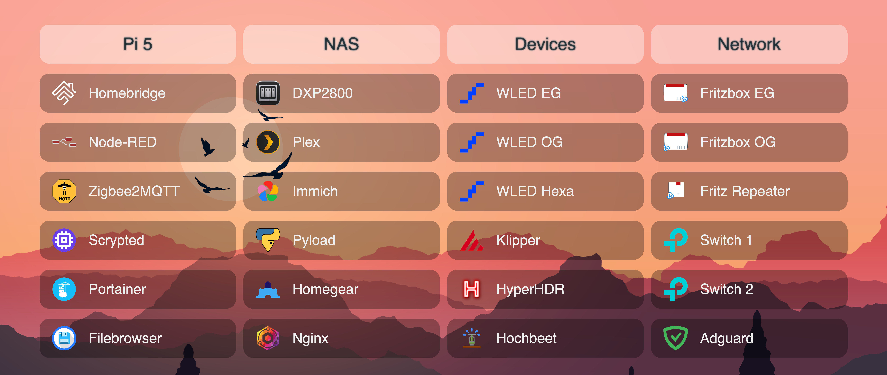
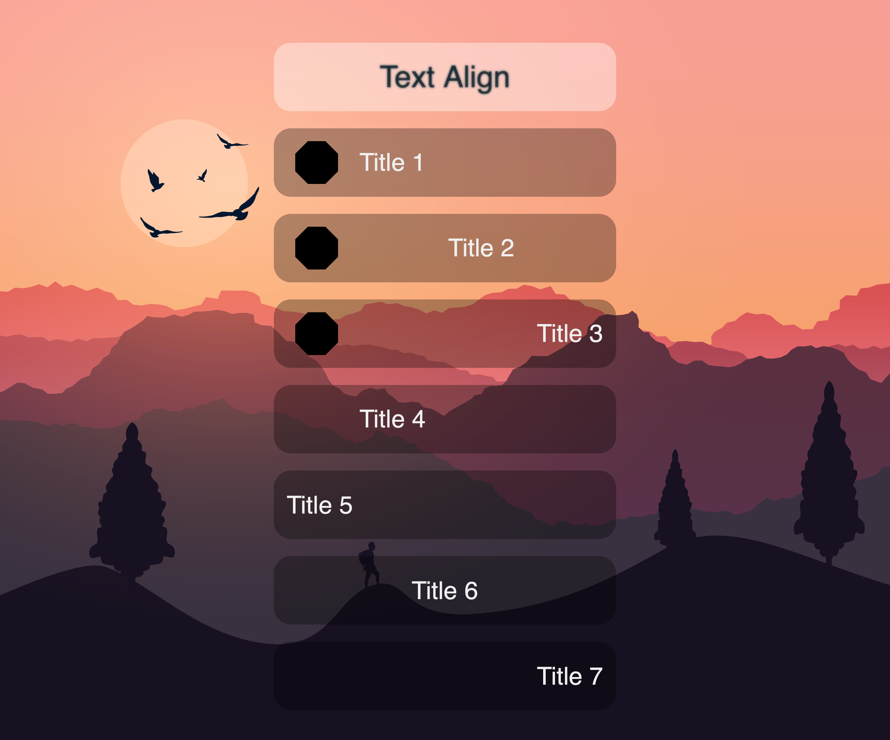

<p align="center">
    
    <br>
    <span style="font-size:1.5rem;font-weight:600;">singpost</span>
    <br>
    <span>A simple, full responsive HTML/CSS/JS webpage to keep an overview of everything in the network.</span>
    <br><br>
    
</p>


## Installation
Clone or download this repository and place the *index.html* file together with the *assets* folder on any running web server.  
Using *localhost* is also possible, but due to CORS restrictions, the page must be served via a web server — you cannot simply open the HTML file directly in a browser.

## Configuration
Edit the *config.json* file inside the *assets* folder.  
The keys are self-explanatory, and for reference, all possible values are already included in the *config.json* file.

## Examples
There are several options for aligning text on the buttons:

<p align="center">
    
</p>

The following configuration corresponds to the example shown above:

```json
...
    "Text Align": [
        {
            "name": "Title 1",
            "icon": "assets/dummy.png",
            "url": "http://192.168.0.123"
        },
        {
            "name": "Title 2",
            "text": "center",
            "icon": "assets/dummy.png",
            "url": "http://192.168.0.123"
        },
        {
            "name": "Title 3",
            "text": "right",
            "icon": "assets/dummy.png",
            "url": "http://192.168.0.123"
        },
        {
            "name": "Title 4",
            "icon": "skip",
            "url": "http://192.168.0.123"
        },
        {
            "name": "Title 5",
            "url": "http://192.168.0.123"
        },
        {
            "name": "Title 6",
            "text": "center",
            "url": "http://192.168.0.123"
        },
        {
            "name": "Title 7",
            "text": "right",
            "url": "http://192.168.0.123"
        }
    ],
...
```

Mobile view:
<p align="center">
</p>


## Credits
Background image by [Kaskar5Z7](https://pixabay.com/users/kaskar5z7-22724723/)